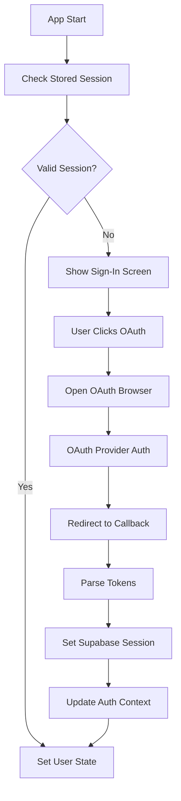
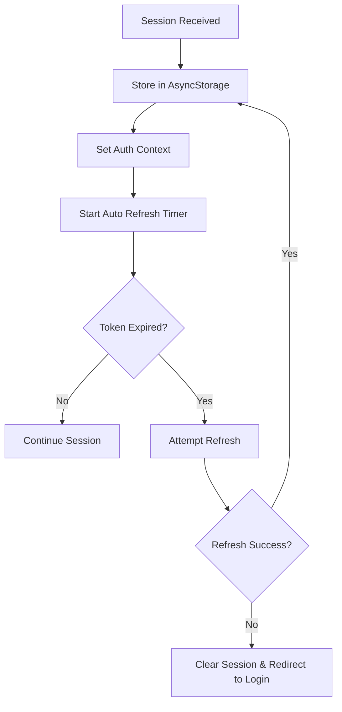

# Design Document

## Overview

This design addresses the Supabase authentication issues by implementing a robust, simplified authentication flow with proper session management, error handling, and OAuth callback processing. The solution focuses on fixing session persistence, simplifying the OAuth flow, and providing clear error states.

## Architecture

### Authentication Flow Architecture



### Session Management Flow



## Components and Interfaces

### 1. Enhanced AuthContext

**Purpose**: Simplified, reliable authentication state management

**Key Changes**:
- Remove complex OAuth handling logic
- Implement proper session persistence
- Add comprehensive error states
- Simplify auth state transitions

**Interface**:
```typescript
interface AuthContextType {
  user: User | null;
  session: Session | null;
  loading: boolean;
  error: string | null;
  signInWithGoogle: () => Promise<void>;
  signInWithApple: () => Promise<void>;
  signOut: () => Promise<void>;
  clearError: () => void;
}
```

### 2. Session Manager Service

**Purpose**: Handle session persistence and validation

**Responsibilities**:
- Store/retrieve sessions from AsyncStorage
- Validate session expiry
- Handle automatic token refresh
- Clear expired sessions

**Interface**:
```typescript
interface SessionManager {
  storeSession(session: Session): Promise<void>;
  getStoredSession(): Promise<Session | null>;
  clearSession(): Promise<void>;
  isSessionValid(session: Session): boolean;
  refreshSession(session: Session): Promise<Session | null>;
}
```

### 3. OAuth Handler Service

**Purpose**: Simplified OAuth flow management

**Responsibilities**:
- Open OAuth browser sessions
- Handle callback URLs
- Extract and validate tokens
- Convert tokens to Supabase sessions

**Interface**:
```typescript
interface OAuthHandler {
  initiateOAuth(provider: 'google' | 'apple'): Promise<AuthResult>;
  handleCallback(url: string): Promise<Session>;
  parseTokensFromUrl(url: string): { accessToken: string; refreshToken: string } | null;
}
```

### 4. Error Handler Service

**Purpose**: Centralized error handling and user messaging

**Responsibilities**:
- Convert technical errors to user-friendly messages
- Log detailed error information for debugging
- Provide retry mechanisms
- Handle different error types (network, auth, validation)

## Data Models

### Enhanced Session Storage

```typescript
interface StoredSession {
  session: Session;
  timestamp: number;
  expiresAt: number;
}
```

### Error States

```typescript
interface AuthError {
  type: 'network' | 'oauth' | 'session' | 'validation' | 'unknown';
  message: string;
  details?: string;
  retryable: boolean;
}
```

### Auth State

```typescript
interface AuthState {
  user: User | null;
  session: Session | null;
  loading: boolean;
  error: AuthError | null;
  isInitialized: boolean;
}
```

## Error Handling

### Error Categories and Responses

1. **Network Errors**
   - Show "Connection issue" message
   - Provide retry button
   - Cache auth state for offline use

2. **OAuth Errors**
   - "Sign-in was cancelled" for user cancellation
   - "Authentication failed" for provider errors
   - Clear instructions for resolution

3. **Session Errors**
   - Automatic retry for token refresh failures
   - Clear session and redirect to login for invalid sessions
   - Preserve user data when possible

4. **Configuration Errors**
   - Clear developer-focused error messages
   - Environment variable validation on startup
   - Fallback to mock auth in development

### Error Recovery Strategies

```typescript
const errorRecoveryStrategies = {
  'TOKEN_EXPIRED': () => attemptTokenRefresh(),
  'NETWORK_ERROR': () => retryWithExponentialBackoff(),
  'INVALID_SESSION': () => clearSessionAndRedirect(),
  'OAUTH_CANCELLED': () => returnToSignIn(),
  'PROVIDER_ERROR': () => showProviderSpecificHelp()
};
```

## Testing Strategy

### Unit Tests
- Session persistence and retrieval
- Token parsing and validation
- Error handling for each error type
- Auth state transitions

### Integration Tests
- Complete OAuth flow simulation
- Session refresh scenarios
- Network failure handling
- Cross-platform session storage

### Manual Testing Scenarios
1. Fresh install → OAuth sign-in → app restart → verify persistence
2. Network disconnection during auth → verify error handling
3. Token expiry → verify automatic refresh
4. Sign out → verify complete session cleanup
5. Multiple OAuth attempts → verify state consistency

## Implementation Priority

### Phase 1: Core Session Management
1. Implement SessionManager service
2. Fix session persistence in AuthContext
3. Add proper session validation
4. Test session storage/retrieval

### Phase 2: OAuth Flow Simplification
1. Implement OAuthHandler service
2. Simplify callback URL parsing
3. Remove complex auth state logic
4. Test OAuth flow end-to-end

### Phase 3: Error Handling Enhancement
1. Implement ErrorHandler service
2. Add user-friendly error messages
3. Implement retry mechanisms
4. Add comprehensive error logging

### Phase 4: Testing and Validation
1. Add unit tests for all services
2. Test cross-platform compatibility
3. Validate error scenarios
4. Performance testing for auth flows

## Security Considerations

### Token Security
- Store tokens securely using AsyncStorage with encryption
- Implement proper token rotation
- Clear sensitive data on sign out
- Validate token integrity

### Session Security
- Implement session timeout handling
- Validate session authenticity
- Protect against session hijacking
- Secure callback URL validation

### Privacy Protection
- Minimize stored user data
- Implement proper data cleanup
- Respect user privacy preferences
- Secure error logging (no sensitive data)

## Performance Optimizations

### Startup Performance
- Lazy load auth services
- Optimize session validation
- Minimize initial auth checks
- Cache auth state appropriately

### Runtime Performance
- Debounce auth state changes
- Optimize token refresh timing
- Minimize re-renders during auth operations
- Efficient error state management