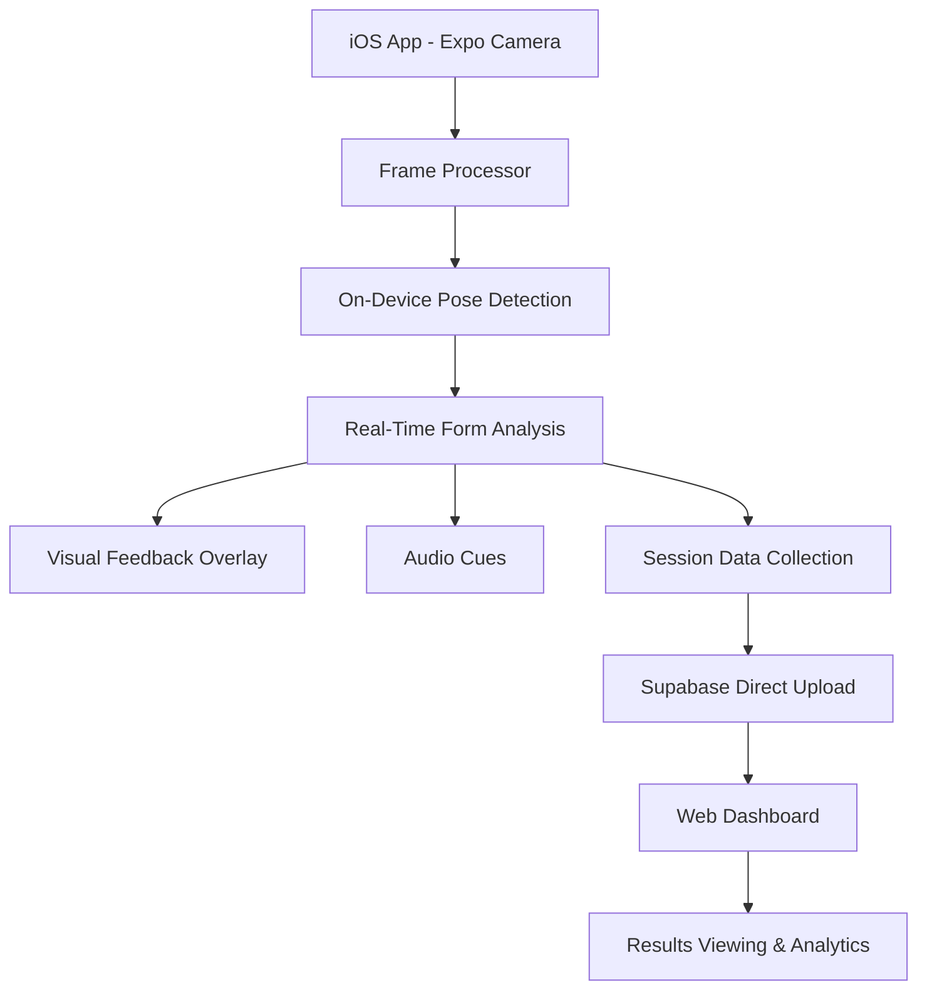
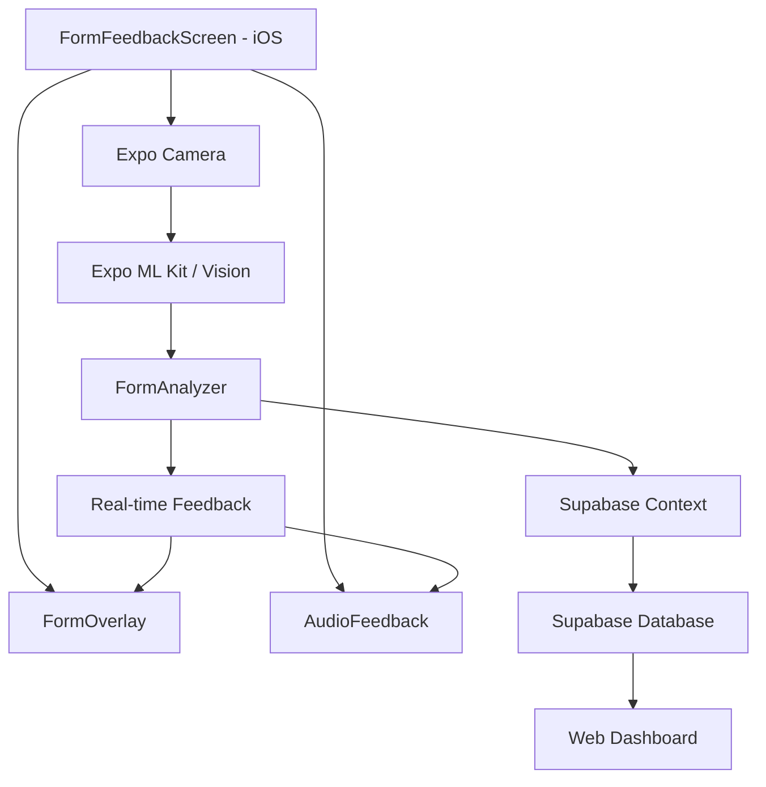

# Design Document

## Overview

The Real-Time Form Feedback feature provides users with immediate visual and audio feedback on their exercise form during workouts. This system uses on-device computer vision to analyze body posture and movement patterns, offering color-coded overlays and audio cues to help users maintain proper technique and prevent injury.

## Architecture

### MVP System Architecture (iOS + Web Dashboard)



### MVP Component Architecture (iOS Focus)



## Components and Interfaces

### 1. Core Interfaces

```typescript
interface PosePoint {
  x: number;
  y: number;
  confidence: number;
}

interface PoseKeypoints {
  nose: PosePoint;
  leftEye: PosePoint;
  rightEye: PosePoint;
  leftEar: PosePoint;
  rightEar: PosePoint;
  leftShoulder: PosePoint;
  rightShoulder: PosePoint;
  leftElbow: PosePoint;
  rightElbow: PosePoint;
  leftWrist: PosePoint;
  rightWrist: PosePoint;
  leftHip: PosePoint;
  rightHip: PosePoint;
  leftKnee: PosePoint;
  rightKnee: PosePoint;
  leftAnkle: PosePoint;
  rightAnkle: PosePoint;
}

interface FormAnalysis {
  overallScore: number; // 0-100
  jointAngles: Record<string, number>;
  feedback: FormFeedback[];
  timestamp: number;
}

interface FormFeedback {
  type: 'good' | 'warning' | 'error';
  joint: string;
  message: string;
  severity: number; // 1-10
}

interface WorkoutSession {
  id: string;
  exercise: string;
  startTime: number;
  endTime?: number;
  repCount: number;
  formScores: FormAnalysis[];
  averageScore: number;
}
```

### 2. Camera and Vision Components

**CameraView Component**
- Manages camera permissions and initialization
- Provides real-time video feed
- Handles frame processing for pose detection
- Supports front/back camera switching

**FrameProcessor Service**
- Processes camera frames at optimal intervals (30fps target)
- Converts frames to format suitable for ML processing
- Manages frame queue to prevent memory issues
- Handles device orientation changes

### 3. Pose Detection Engine

**PoseDetector Service**
- Integrates MediaPipe Pose or TensorFlow Lite
- Runs pose estimation on-device for privacy
- Returns 17 key body landmarks with confidence scores
- Optimized for real-time performance

**MVP Implementation (iOS Focus):**
1. **Expo Camera**: Built-in camera integration with React Native
2. **Expo ML Kit / Vision**: On-device pose detection for iOS
3. **Direct Supabase Integration**: No separate API layer needed for MVP

### 4. Form Analysis Engine

**FormAnalyzer Service**
- Calculates joint angles from pose keypoints
- Compares angles against exercise-specific ideal ranges
- Generates form scores and feedback messages
- Tracks movement patterns over time

**Exercise-Specific Analysis:**
```typescript
interface ExerciseConfig {
  name: string;
  keyJoints: string[];
  idealAngles: Record<string, { min: number; max: number; optimal: number }>;
  commonMistakes: FormMistake[];
  calibrationPoints: string[];
}

interface FormMistake {
  condition: (angles: Record<string, number>) => boolean;
  message: string;
  severity: number;
  audioFeedback: string;
}
```

### 5. Feedback Systems

**Visual Feedback Component**
- Overlays skeleton on camera feed
- Color-codes joints (green=good, yellow=warning, red=error)
- Shows real-time form score
- Displays text feedback messages

**Audio Feedback Service**
- Provides voice prompts for form corrections
- Positive reinforcement for good form
- Configurable volume and frequency
- Supports multiple languages

### 6. Calibration System

**CalibrationManager**
- Guides users through initial setup
- Detects optimal camera distance and angle
- Establishes user's baseline measurements
- Saves calibration data for future sessions

**Calibration Process:**
1. Camera positioning guidance
2. Body landmark detection verification
3. Range of motion testing
4. Baseline angle measurement
5. Calibration validation

## Data Models

### Session Storage

```typescript
interface StoredSession {
  id: string;
  userId: string;
  exercise: string;
  startTime: number;
  endTime: number;
  repCount: number;
  formScores: FormAnalysis[];
  averageScore: number;
  calibrationData: CalibrationData;
  deviceInfo: {
    platform: string;
    cameraPosition: 'front' | 'back';
    screenDimensions: { width: number; height: number };
  };
}

interface CalibrationData {
  cameraDistance: number;
  cameraAngle: number;
  userHeight: number;
  baselineAngles: Record<string, number>;
  timestamp: number;
}
```

### MVP Supabase Schema (Simplified)

```sql
-- Extend existing workouts table for form feedback
ALTER TABLE workouts ADD COLUMN form_score DECIMAL(5,2);
ALTER TABLE workouts ADD COLUMN pose_data JSONB;
ALTER TABLE workouts ADD COLUMN feedback_summary JSONB;

-- New form analysis table for detailed data
CREATE TABLE form_analyses (
  id UUID PRIMARY KEY DEFAULT gen_random_uuid(),
  workout_id UUID REFERENCES workouts(id),
  rep_number INTEGER NOT NULL,
  timestamp_ms INTEGER NOT NULL,
  pose_keypoints JSONB NOT NULL,
  joint_angles JSONB NOT NULL,
  form_score DECIMAL(5,2) NOT NULL,
  feedback_cues JSONB,
  created_at TIMESTAMPTZ DEFAULT NOW()
);

-- Simple user preferences for form feedback
CREATE TABLE form_preferences (
  id UUID PRIMARY KEY DEFAULT gen_random_uuid(),
  user_id UUID REFERENCES auth.users(id),
  audio_enabled BOOLEAN DEFAULT true,
  feedback_sensitivity INTEGER DEFAULT 5, -- 1-10 scale
  preferred_exercises JSONB,
  created_at TIMESTAMPTZ DEFAULT NOW(),
  updated_at TIMESTAMPTZ DEFAULT NOW()
);
```

## Error Handling

### Camera Errors
- Permission denied → Show permission request modal
- Camera not available → Fallback to manual workout logging
- Poor lighting → Show lighting improvement tips
- Device orientation issues → Guide user to correct position

### ML Processing Errors
- Pose detection failure → Show positioning guidance
- Low confidence scores → Reduce feedback sensitivity
- Performance issues → Adjust frame processing rate
- Memory constraints → Implement frame queue management

### Network Errors
- Offline mode → Store data locally, sync when online
- Sync failures → Retry with exponential backoff
- Data corruption → Validate and clean data before storage

## Performance Optimizations

### Real-Time Processing
- Target 30fps for smooth experience
- Use native modules for heavy computation
- Implement frame skipping during high load
- Optimize ML model size and inference speed

### Memory Management
- Limit frame buffer size
- Clean up processed frames immediately
- Use object pooling for frequent allocations
- Monitor memory usage and implement warnings

### Battery Optimization
- Reduce processing when app is backgrounded
- Implement adaptive frame rate based on device performance
- Use efficient camera settings
- Provide battery usage warnings

## Privacy and Security

### On-Device Processing
- All pose detection happens locally
- No video data sent to servers
- Only numerical form scores are stored
- User can delete all form data

### Data Protection
- Encrypt stored session data
- Implement data retention policies
- Provide data export functionality
- Clear data on app uninstall

## Testing Strategy

### Unit Tests
- Form analysis algorithms
- Angle calculation functions
- Feedback generation logic
- Data storage and retrieval

### Integration Tests
- Camera → Pose Detection → Analysis pipeline
- Real-time feedback display
- Session storage and sync
- Calibration workflow

### Performance Tests
- Frame processing speed
- Memory usage under load
- Battery consumption
- Device compatibility

### User Testing
- Form feedback accuracy
- Calibration ease of use
- Audio feedback clarity
- Overall user experience

## MVP Implementation Phases (iOS First)

### Phase 1: Core iOS App
1. Expo Camera integration with permissions
2. Basic pose detection using Expo ML Kit
3. Simple real-time form scoring
4. Visual overlay with basic feedback

### Phase 2: Supabase Integration
1. Extend existing workout context for form data
2. Real-time data upload during workouts
3. Form analysis data storage
4. Integration with existing auth system

### Phase 3: Web Dashboard
1. Simple web interface for viewing results
2. Form score visualization and trends
3. Workout session replay (data-based)
4. Basic analytics and insights

### Phase 4: Enhanced Features
1. Audio feedback system
2. Multiple exercise support
3. Performance optimizations
4. Advanced analytics