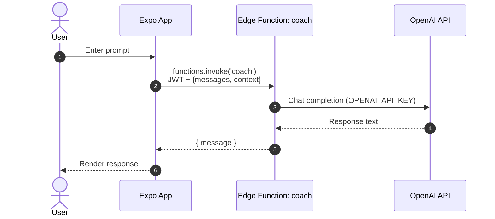
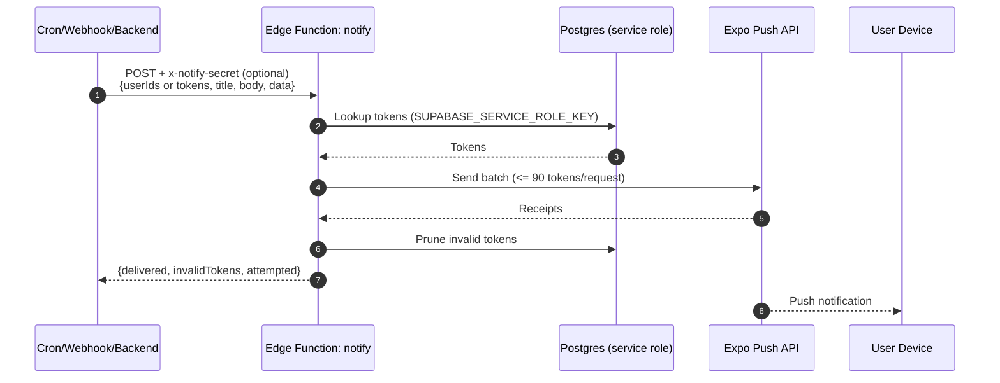

# Form Factor 💪

Form Factor is an iOS-first fitness and health app built with Expo and Supabase. It gives real-time form cues from the phone camera—counting reps, flagging issues (e.g., swing on pull-ups, squat depth), and auto-logging sets—to improve outcomes and reduce injury. It also delivers fast offline workout/food logging, HealthKit-powered trends, video and form capture, and an experimental ARKit body-tracking flow. Web is mostly display-first.

## What it does
- Tracking: Offline-first foods and workouts using SQLite with sync queue, realtime backfill, conflict handling, and soft delete to Supabase.
- Health: HealthKit permissions, summaries (steps, HR, weight), trend analysis, and historical bulk sync to Supabase; watch connectivity helpers included.
- Form & media: ARKit body-tracking tab (pull-up/push-up rep detection, speech cues, Vision Camera overlay), video capture/upload to Supabase Storage, and a feed with signed URLs plus comments.
- Coach & notifications: AI coach backed by Supabase Edge Function `coach` (OpenAI), push token registration and preferences, and Edge Function `notify` for Expo push delivery.
- UI/Navigation: Expo Router tabs, NativeWind/Tailwind styling, React Native Paper components; web target is read-only with Playwright smoke coverage.

## Status and roadmap
- Implemented: offline foods/workouts, HealthKit summaries/trends, video upload + feed, AI coach, push notification plumbing, Playwright auth flow, Jest unit scaffolding.
- In progress: ARKit body-tracking polish and metrics upload, broader E2E coverage, telemetry/error-handling hardening.
- Planned: Richer social/feed interactions, ML recommendations, production push campaigns.

## Repository layout
- `app/`: Expo Router screens (`(auth)`, `(tabs)`, `(modals)`); ARKit scan and dashboard live here.
- `components/`, `contexts/`, `hooks/`, `lib/`: shared UI, data, services (offline sync, healthkit, notifications, coach/video services).
- `modules/arkit-body-tracker/`: custom native module for ARKit.
- `supabase/`: migrations and Edge Functions (`coach`, `notify`), plus storage bucket policies.
- `scripts/`: env/setup helpers, native build utilities, and repair scripts (UUID fixes, pose plugin, etc.).
- Tooling configs (Babel, Metro, Tailwind, ESLint, Playwright, custom `tslib` shim) live in `etc/`; root stubs re-export them.

## Getting started (local)
1) Install deps: `bun install`.  
2) Copy env: `cp .env.example .env.local` (or `./scripts/setup-env.sh`) and fill `EXPO_PUBLIC_SUPABASE_URL/ANON_KEY`, `EXPO_PUBLIC_PUSH_PROJECT_ID`, `EXPO_TOKEN` for EAS builds, plus optional `EXPO_PUBLIC_COACH_FUNCTION` (defaults to `coach`).  
3) Run Expo: `bun run start` (or `bun run start:devclient`). Platform targets: `bun run ios`, `bun run android`, `bun run web`.  
4) Variants map to `APP_VARIANT` in `eas.json` (`development`, `preview`, `staging`, `production`).  
5) Supabase CLI users: set `SUPABASE_*` values from `.env.example` before running migrations or Edge Functions locally.

## EAS Build Policy
- `eas build` does **not** run for pull requests; paid builds happen on `main` after merge (and on `develop` if you keep staging deploys automatic).
- Every PR must pass the Husky `pre-push` hook locally (runs `python3 scripts/ci_local.py --quick`, then a local iOS preview build).
- You can run `bun run ci:push` anytime to reproduce the hook, or `bun run preview:local:submit` to build locally and upload/submit the same `.ipa`.

## Testing and QA
- Lint/types: `bun run lint`, `bun run check:types`, `bun run check:dead-code`.
- Unit: `bun run test` (Jest + Testing Library).
- E2E (web target): `bunx playwright test` (uses Expo web via `etc/playwright.config.ts`).

## Backend (Supabase)

### Edge Functions (request flow)

### Source-of-truth links
- Migrations / schema: `supabase/migrations/`
- Storage policies: `supabase/migrations/012_create_video_buckets.sql`
- Coach guide: `docs/COACH_FUNCTION.md`
- Edge function code: `supabase/functions/coach/index.ts`, `supabase/functions/notify/index.ts`

## Documentation
- Repo standards and commands: `docs/AGENTS.md`.
- ARKit: `docs/ARKIT_BODY_TRACKING_GUIDE.md`.
- HealthKit sync/trends: `docs/HEALTHKIT_SYNC_AND_TRENDS_GUIDE.md` and `docs/HEALTHKIT_SYNC_QUICK_START.md`.
- Platform-specific/native tips: `docs/PLATFORM_SPECIFIC_CODE_GUIDE.md`, `docs/WATCH_APP_GUIDE.md`.
- CI/CD and releases: `docs/CI-CD.md`, `docs/TESTFLIGHT_WORKFLOW.md`, `docs/TESTFLIGHT_RELEASE.md`.
